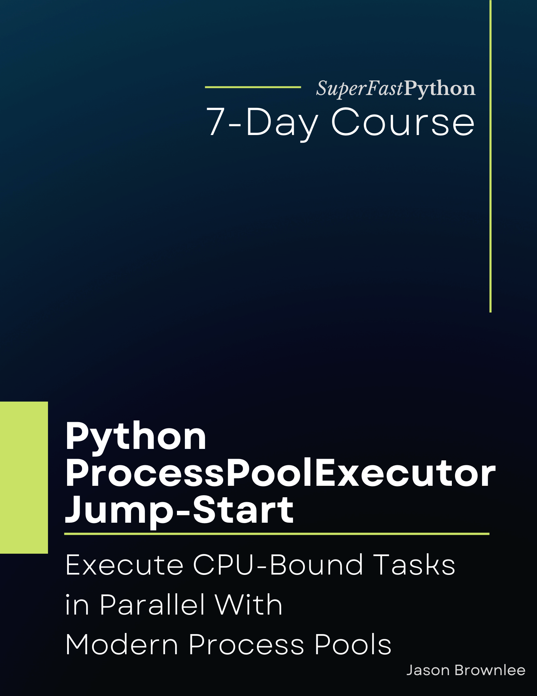

# Python ProcessPoolExecutor Jump-Start

* <https://github.com/SuperFastPython/PythonProcessPoolExecutorJumpStart>

This repository provides all source code for the book:

* **Python ProcessPoolExecutor Jump-Start**: _Execute CPU-Bound Tasks in Parallel With Modern Process Pools_, Jason Brownlee, 2022.

## Source Code
You can access all Python .py files directly here:

* [src/](src/)

## Get the Book

You can learn more about the book here:

* Coming soon

### Book Blurb

> How much faster could your python code run (if it used all CPU cores)?
>
> The ProcessPoolExecutor class provides modern process pools for CPU-bound tasks.
>
> This is not some random third-party library, this is a class provided in the Python standard library (already installed on your system).
>
> This is the class you need to make your code run faster.
>
> There's just one problem. No one knows about it (or how to use it well).
>
> Introducing: "Python ProcessPoolExecutor Jump-Start". A new book designed to teach you modern process pools in Python, super fast!
>
> You will get a rapid-paced, 7-part course to get you started and make you awesome at using the ProcessPoolExecutor.
>
> Including:
>
> * How to create process pools and when to use them.
> * How to configure process pools including the number of workers.
> * How to execute tasks with worker processes and handle for results.
> * How to execute tasks in the process pool asynchronously.
> * How to query and get results from handles on asynchronous tasks called futures.
> * How to wait on and manage diverse collections of asynchronous tasks.
> * How to develop a parallel Fibonacci calculator 4x faster than the sequential version.
>
> Each of the 7 lessons was carefully designed to teach one critical aspect of the ProcessPoolExecutor, with explanations, code snippets and worked examples.
>
> Each lesson ends with an exercise for you to complete to confirm you understood the topic, a summary of what was learned, and links for further reading if you want to go deeper.
>
> Stop copy-pasting code from StackOverflow answers.
>
> Learn Python concurrency correctly, step-by-step.